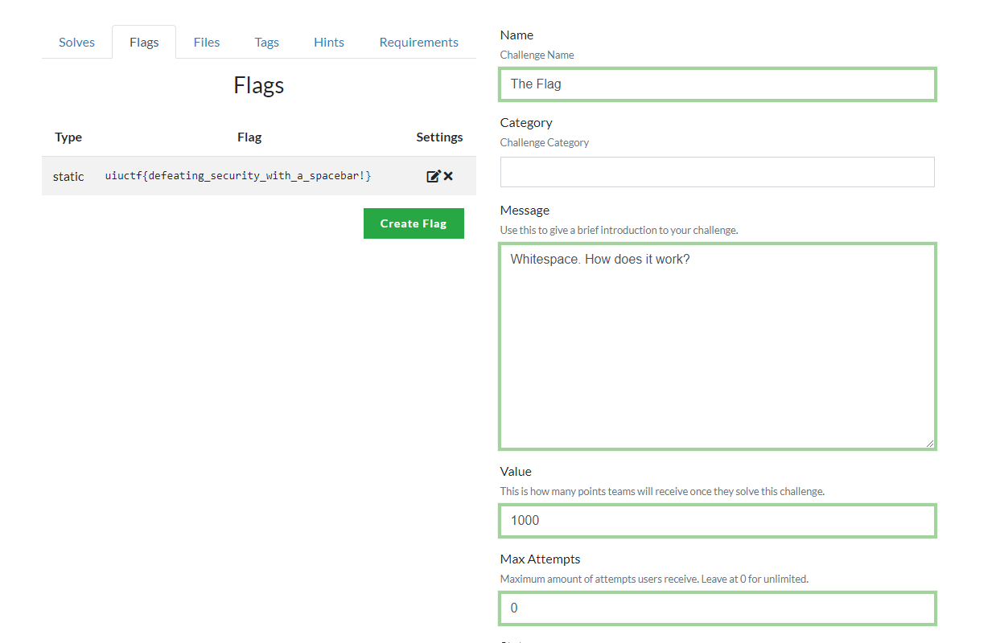

## Just a Normal CTF - 100 points - 113 solves

>Do NOT use sensitive passwords on this site. You can use a fake email if you want, too.
>
>https://ctfd.chal.uiuc.tf
>
>Author: tow_nater

We go to the link provided at https://ctfd.chal.uiuc.tf/ . This link leads us to the all-too-familiar CTFd login page. We also notice that there is only one user in the database, named “admin”.

We now make an account and see that on the “Challenges” page there is only one challenge, titled “The Flag”.

The description says:

>Whitespace. How does it work?

This hints at a common vulnerability where making an account with the same name as another account but with some whitespace before or after the name can in some circumstances be treated like the original account.

We then look up on Google the term “whitespace vulnerability ctfd” and we find several results, including a link to https://nvd.nist.gov/vuln/detail/CVE-2020-7245 .

We follow the instructions in the National Vulnerability Database article, starting with registering with an account named “admin ” (notice the space at the end).

Now, we log out and initiate a password reset. We get greeted with a screen that looks like this:

Looks like we are on the right track! Now, we go to the link that we are directed to, and we reset the password. Now, we try to log in as the real “admin” account with our new password:

It works! We now have access to the admin panel and we can see the flag to the challenge.

Flag: *uiuctf{defeating_security_with_a_spacebar!}*
