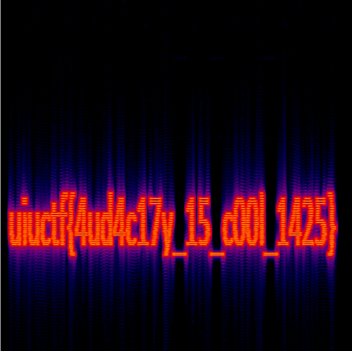

## K.K's Mixtape - 20 points - 191 solves

When we open the audio and listen to it, it sounds like gibberish. So, we go to the spectrogram generator at https://convert.ing-now.com/audio-spectrogram-creator/ . We put the file in and press the “go” button. The output is this picture:

Flag: *uiuctf{4ud4c17y_15_c00l_1425}*

(huh, what's audacity?)
