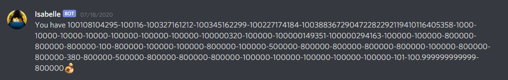
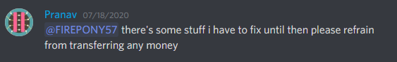
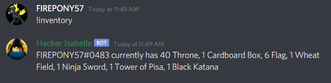

## Omega Stonks - 50 points - 25 solves

>If you solve this challenge, straightup you have Omega Stonks.
>
>(Buy this flag from IsabelleBot)

The flag was in the “store” in the #isabelle channel, and it cost 500,000 bells. The way to get bells was to work by using the command “!work”. Every time you ran the command “!work”, the bot awarded you an amount of money from 100 to 500 bells.

However, slowmode was enabled on the only channel we could “!work” in, meaning that we could only run the command every 10 seconds(this was increased to 15 minutes later in the CTF). 

This meant that the *intended* solution to this challenge was by using the “!bet” command. You could earn way higher amounts of bells by betting on what challenge would be solved next (betting was broken throughout most of the ctf, though). 

The solution we had for this challenge was VERY unintended. 

During the CTF, *someone* along the line decided that it would be a good idea to transfer negative money from to other people, to try to “steal” their bells. Most likely, the post got deleted, but the result was that FIREPONY57#0483 gained the ability to wield an infinite number of bells. 

After the CTF ended, it was revealed that this happened because of unsanitized input, and it ended up turning FIREPONY57#0483’s balance into some sort of string, effectively throwing a wrench into the system. In the end, his balance looked like this:

The bug in the bot apparently also brought up discussion among the admins, leading to the prize for most bells being removed. Several DMs asking for bells also were sent to FIREPONY57#0483. Of course, he refused all of them, after Pranav, the bot’s creator, told him to not transfer any more bells to others. ;) 

Of course, that didn't stop FIREPONY57#0483 from enjoying his wealth.

From then on, FIREPONY57#0483’s balance kept on growing, and after some experimentation, he found out that he could transfer any amount of money to other people under 100999 bells. Only 5 of these transfers were needed to buy the flag. 

After transferring many bells to his teammate Eth007#0804, Eth007 could buy the flag, which was sent in a direct message. 

(Note: We got third blood on this challenge, because we were beat by two teams who presumably used bets or alternate Discord accounts to get more bells(namely, /[spin]*s/).)

Flag: *uiuctf{so_much_money_so_much_time_enjoy_50_points_XD}*
