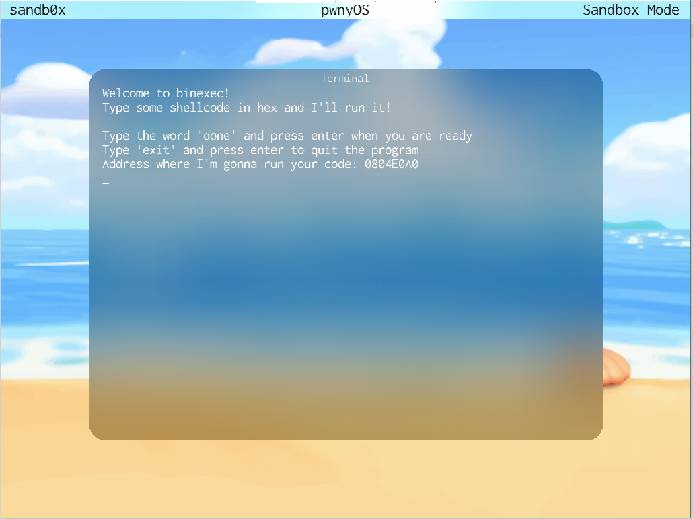
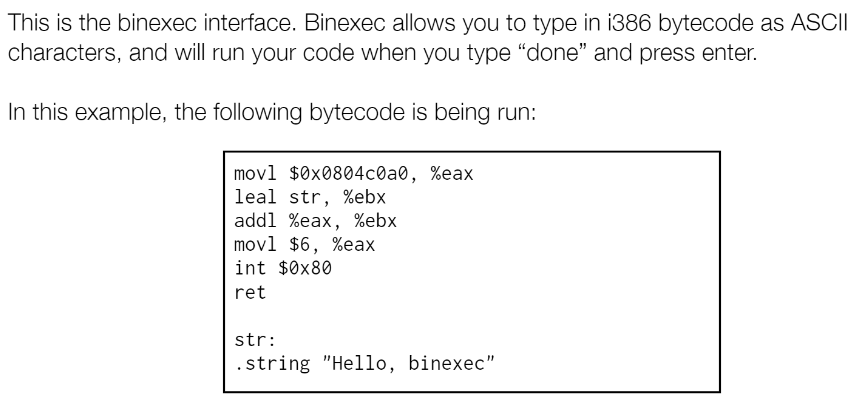
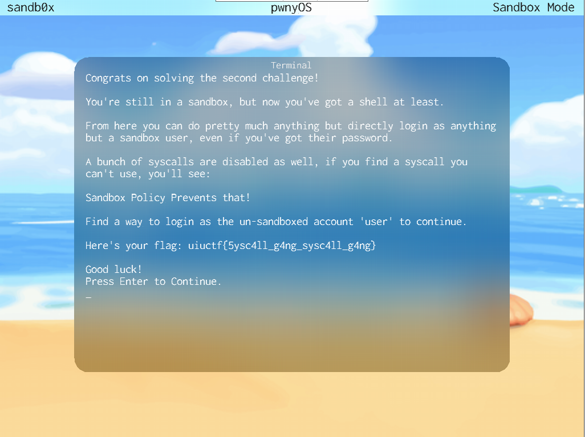

## Whats_A_Syscall? - 100 points - 67 solves

>Syscall 14 is known as "SANDBOX_SPECIAL"... I wonder if that would be useful here.
>
>You'll be stuck in a never ending loop of binexec until you perform syscall 14.
>
>To learn about syscalls and how they work in pwnyOS, check out the documentation!
>
>System Calls in pwnyOS: >https://github.com/sigpwny/pwnyOS-2020-docs/blob/master/Syscalls.pdf
>
>Author: ravi

We are stuck in a loop of a program called “binexec”. We just need to type in some hex-encoded shellcode.

One problem. I don’t know anything about shellcode.

So, we need to find a better solution than writing and compiling some code from scratch. We turn to the docs for some help.

In the binexec section of the docs, we see that they have provided an example shellcode script, that calls syscall 6, SYS_ALERT. 

So, we look at the hex that was generated from this assembly code, copied from the screenshot that was provided:

>b8 a0 c0 04 08 8d 1d 15 00 00 00 01 c3 b8 __06__ 00 00 00 cd 80 c3 48 65 6c 6c 6f 2c 20 62 69 6e 65 78 65 63 00

We notice that in the hex, we see that there is a section that reads “06”(bolded above). This must have been generated by the part in the assembly code that called syscall number 6. So, to call syscall 14(SANDBOX_SPECIAL) instead, we can change the “06” to a “0e”, hex for 14. We can now enter this code:

    b8 a0 c0 04 08 8d 1d 15 00 00 00 01 c3 b8 0e 00 00 00 cd 80 c3 48 65 6c 6c 6f 2c 20 62 69 6e 65 78 65 63 00

We can now use our AutoHotKey script that we made for the challenge “Showcase” in order to send our code into the VM.

Now, we type “done” and press enter. We get greeted with a screen with a flag and instructions for the next step. (Which we unfortunately couldn’t solve. Well, so much for solving the challenge with no knowledge of shellcode.)

Flag: *uiuctf{5ysc4ll_g4ng_sysc4ll_g4ng}*
