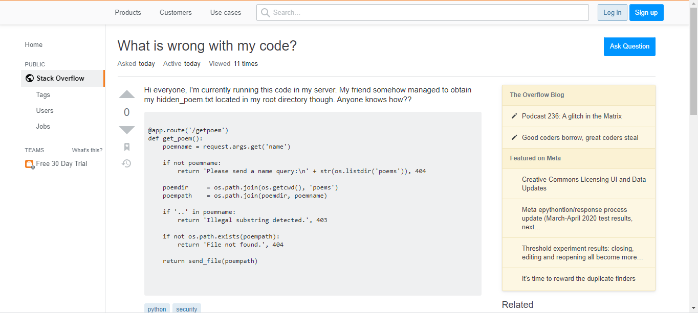
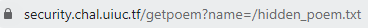

## security_question - 100 points - 250 solves

>Someone just asked a very interesting question online. Can you help them solve their >problem?
>
>author: Husincostan

On entering this challenge, we are greeted with a page that looks much like StackOverflow. 

But we aren’t fooled. The URL reveals that this is a site run by UIUCTF, so the flag is probably on this server.

We see that the post has provided the source code for a file called “getpoem” that is probably vulnerable to path transversal. Because it filters out the string “..”, we put in the absolute path of the poem that the post writer mentions(“/hidden_poem.txt”) and we get the flag.

Link: https://security.chal.uiuc.tf/getpoem?name=/hidden_poem.txt

Flag: *uiuctf{str_join_is_weird_in_python_3}*
