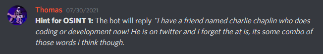
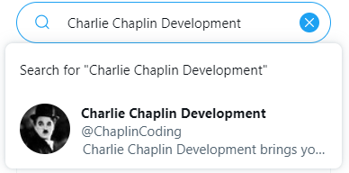
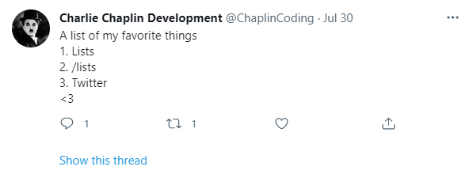
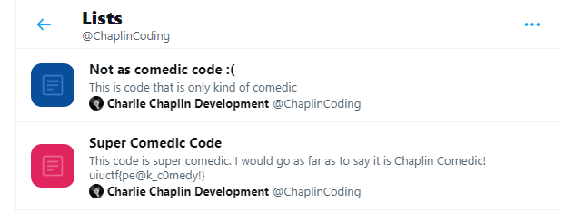

# Chaplin's PR Nightmare 1 - 50 pts, 200 solves

> Charlie Chaplin has gotten into software development, coding, and the like... He made a company, but it recently came under fire for a PR disaster. He got  **all over the internet**  before he realized the company's mistake, and is now scrambling to clean up his mess, but it may be too late!! Find his Twitter Account and investigate!  _NOTE THAT THESE CHALLENGES DO NOT HAVE DO BE DONE IN ORDER!_

>The inner content of this flag begins with  **"pe"**

>Hint: If you are struggling to find his Twitter account, check out the #chal-updates channel in our [Discord](https://discord.gg/uiuctf)

In this challenge we are tasked with the challenge of finding Charlie Chaplin's Twitter for software development and coding. Through a quick Google search, we find that there are many Charlie Chaplin Twitters. But the challenge hints that the Twitter we are looking for will have something to do with software development and coding.

The hint on discord tells us, "_I have a friend named charlie chaplin who does coding or development now! He is on twitter and I forget the at is, its some combo of those words i think though._" We can use the hint to get some idea of what to search up on twitter to get the account by searching up a combo of the words they give us. 

Some combinations we can try are, "Charlie Chaplin Software", "Charlie Chaplin Coding", and "Charlie Chaplin Development".  When searching up "Charlie Chaplin Coding", and "Charlie Chaplin Development", we find an account called `Charlie Chaplin Development` with the at `@ChaplinCoding`.

We start to investigate his tweets but we don't find anything out of the ordinary. During the competition, at around 1 hour after uiuctf started, `Charlie Chaplin Development` tweeted:

We know twitter has a lists page for each user, so we go to where `@ChaplinCoding`'s lists are located: https://twitter.com/ChaplinCoding/lists. There we see the flag in on of his lists.

Flag: `uiuctf{pe@k_c0medy!}`
