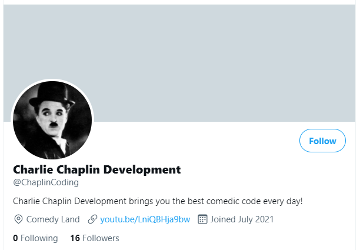
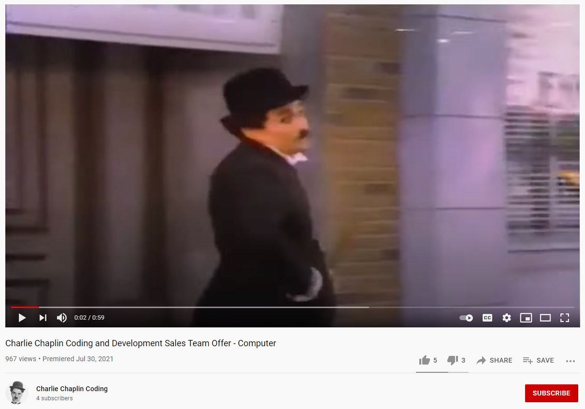
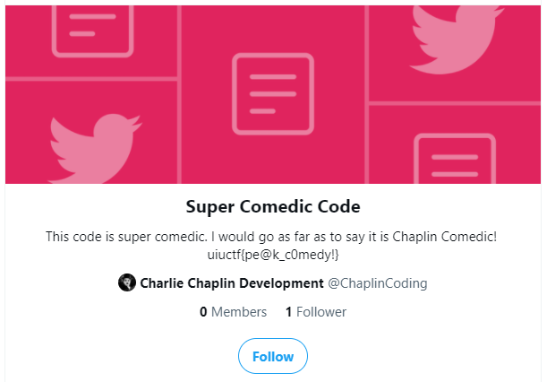

# Chaplin's PR Nightmare 2 - 50 pts, 233 solves
>Charlie made an advertisement to promote his company, he is using the modern media platform YouTube to present it! Can you find it?

>The inner content of this flag begins with **"ch"**

Note: Reading all [previous writeups](https://github.com/Eth007/CTF-Writeups/tree/master/UIUCTF%202021) for this OSINT series will help make this writeup less confusing. :)

This challenge hints at the flag being hidden on YouTube, so we can assume we are looking for a `Charlie Chaplin Coding` YouTube channel. Solving the previous challenge in this OSINT series helped a lot in this challenge.

In the previous challenge, we found Charlie's [twitter](https://twitter.com/ChaplinCoding), and we see a "YouTube" link on his twitter profile.

When we click on the YouTube link, thankfully it is not a rickroll. Instead it brings us to a YouTube video on the `Charlie Chaplin Coding` YouTube channel.

If we take our time to watch through the video, we see it an advertisement for the first IBM personal computers starring Charlie Chaplin. Near the end if we don't click off the video, we see the flag.

Flag: `uiuctf{ch@plin_oN_th3_tV!!}`

Thanks to Thomas for all the great OSINT challenges! ♥️ 
