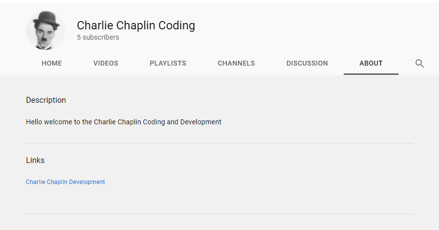
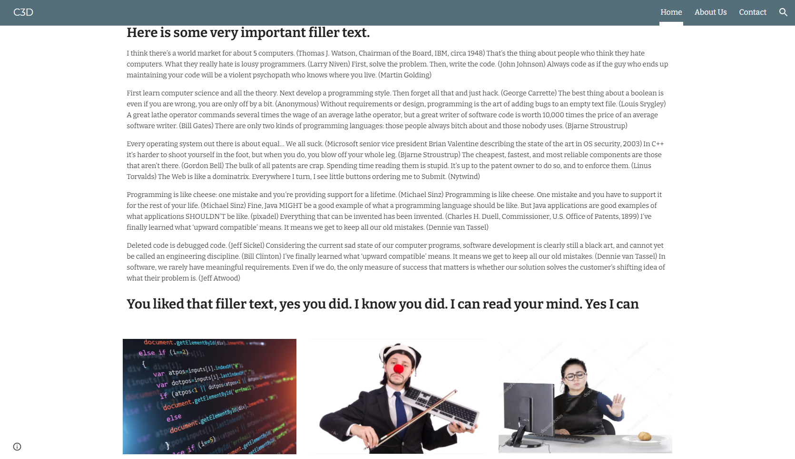
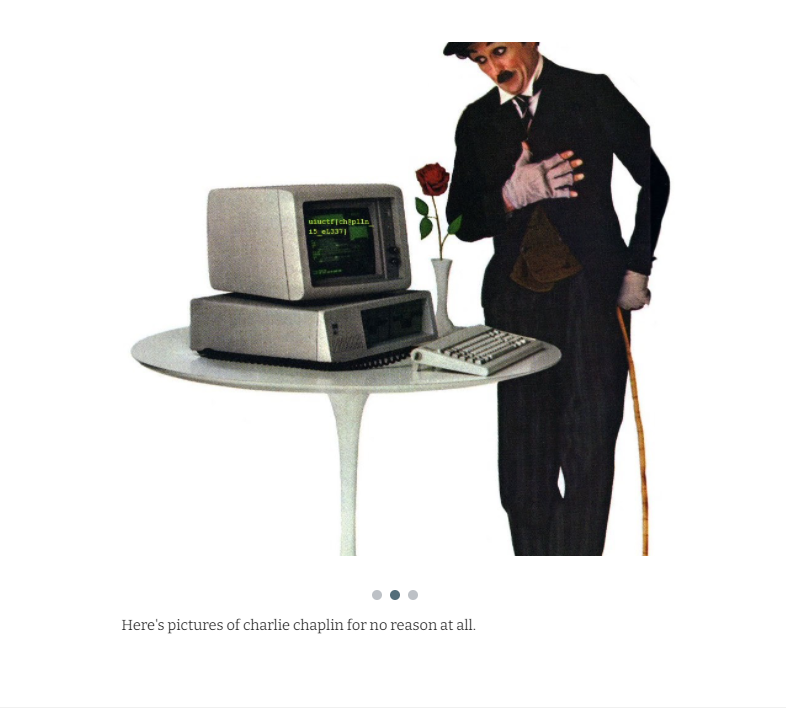

# Chaplin's PR Nightmare 3 - 50 pts, 208 solves
>Charlie even has a website!!! Find it and look around!

>The inner content of this flag begins with  **"ch"**

>Hint: Google sites is a really easy way to make a personal website.

Note: Reading all [previous writeups](https://github.com/Eth007/CTF-Writeups/tree/master/UIUCTF%202021) for this OSINT series will help make this writeup less confusing. :)

The challenge description tells us to go find Charlie's website. YouTube usually has an about section in their channel about that may contain some extra information about the user. 

We found his [YouTube](https://www.youtube.com/channel/UCxPyHVMa8TyKrOj05x86osA/featured) channel in the last OSINT challenge, and if we go to the about page, sure enough, there is a link to his website.

If we take a look at his home page, we can see that there are some interesting filler text, along with some interesting photos.

Doing `ctf+f` for the flag returns nothing, but if we take out time to scroll through the pictures, we can see that one of them has the flag.

Flag: `uiuctf{ch@pl1n_i5_eL337}`

Thanks to Thomas for all the great OSINT challenges! ♥️ 
