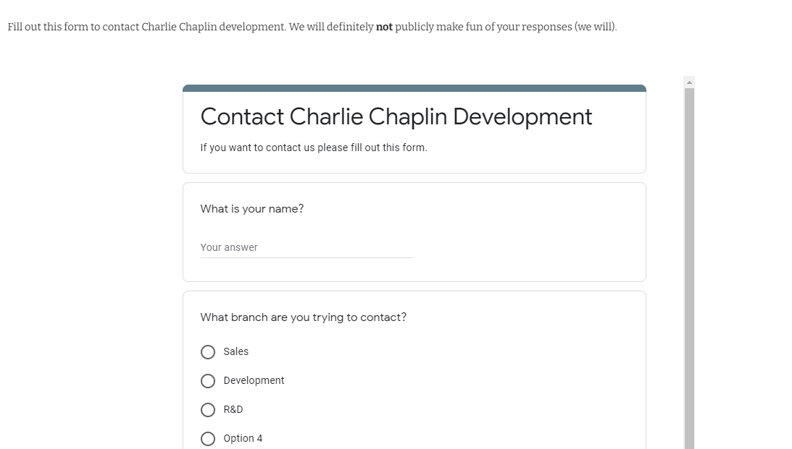
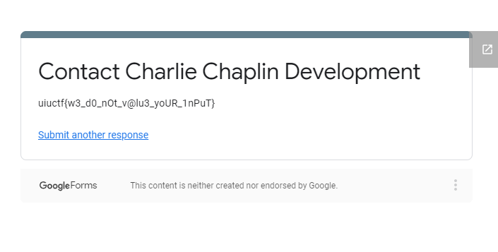

# Chaplin's PR Nightmare 4 - 50 pts, 228 solves
>Charlie left another flag on his company's website. Maybe you have to reach out to him???

>The inner content of this flag begins with **"w3"**
>
Note: Reading all [previous writeups](https://github.com/Eth007/CTF-Writeups/tree/master/UIUCTF%202021) for this OSINT series will help make this writeup less confusing. :)

In this OSINT challenge, we have to look for another flag on Charlie Chaplin's C3D website. The challenge also hints on the fact that we have to try to "reach out" to him.

We have already found his [website](https://www.charliechaplin.dev/contact) in the previous OSINT challenges in this series. Conveniently, there is a tab on the website that is labeled "Contact".

On the contact page, we get a google form that we can fill out to "contact" Charlie Chaplin.

Thankfully, nothing in the google form is required for us to fill out, and submitting a blank form gives us a flag at the end of the form.

Flag: `uiuctf{w3_d0_nOt_v@lu3_yoUR_1nPuT}`

Thanks to Thomas for all the great OSINT challenges! ♥️ 
