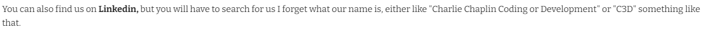
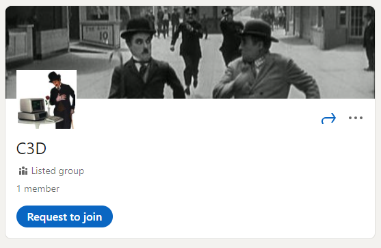
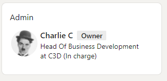
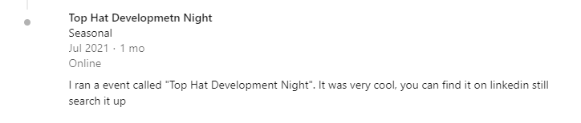
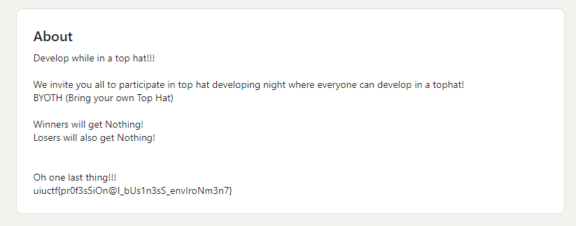

# Chaplin's PR Nightmare 6 - 50 pts, 127 solves
>Wow Charlie even set up a linkedin account, but not well it is kind of a mess. Is the PR nightmare here??

>The inner content of this flag begins with  **"pr"**
>
Note: Reading all [previous writeups](https://github.com/Eth007/CTF-Writeups/tree/master/UIUCTF%202021) for this OSINT series will help make this writeup less confusing. :)

In this challenge, we need to find Charlie's LinkedIn account. There is nothing on his Twitter or Imgur that talks about his LinkedIn, but if we go to his [website](https://www.charliechaplin.dev/), we see something interesting that may help us find his LinkedIn. 

It gives us some search phrases to look up just like the first Twitter challenge. Searching up "Charlie Chaplin Coding" or "Charlie Chaplin Development" on LinkedIn returns nothing, but searching up "C3D" does.

`C3D` is a LinkedIn group for Charlie's "Company". We can see the owner of the group is `Charlie C.` and therefore we have found Charlie's LinkedIn.

Glancing at his profile doesn't show us anything suspicious until we look at the number of events Charlie has hosted. The one that interests us is the "Top Hat Development Night".

Note: During the ctf, we were able to search up "Top Hat Development Night" and find the event, but for some reason we can not do that anymore. 

Once we find the [event](https://www.linkedin.com/events/tophatdevelopmentnight6822753659445743616/) on LinkedIn, we see that at the bottom of the description for the event, there is a flag.

Flag: `uiuctf{pr0f3s5iOn@l_bUs1n3sS_envIroNm3n7}`

Thanks to Thomas for all the great OSINT challenges! ♥️ 
