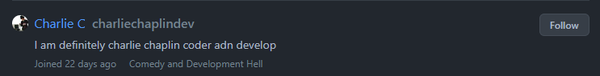
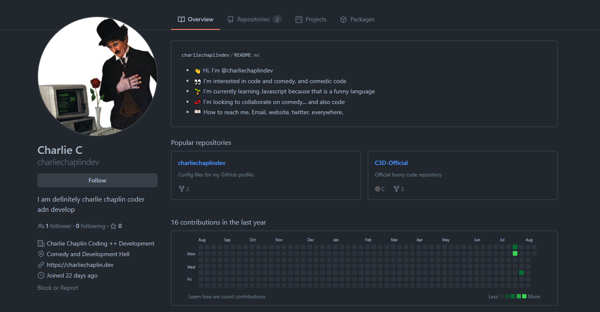
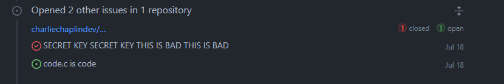
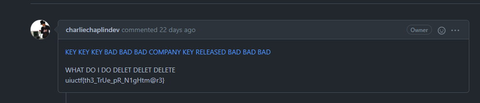

# Chaplin's PR Nightmare 7 - 50 pts, 127 solves
>Chaplin left some code up on GitHub which may be the actual PR nightmare I hope not though... Leaked code is bad. Find it!!!

>The inner content of this flag begins with **"th"**

Note: Reading all [previous writeups](https://github.com/Eth007/CTF-Writeups/tree/master/UIUCTF%202021) for this OSINT series will help make this writeup less confusing. :)

We now need to find the actual PR nightmare which is on Charlie's GitHub. We can guess his GitHub by searching up "charliechaplin" on GitHub to look for his account.

If we look at the users that have "charliechaplin" in their username, we find `charliechaplindev`.

He has a few repositories, but there are no flags in it. But we can look at his activity to see what else he has been doing.

While scrolling through his activity we see a strange issue Charlie has opened in one of his repositories.

Clicking on this issue, we find the flag.

Flag: `uiuctf{th3_TrUe_pR_N1gHtm@r3}`

Thanks to Thomas for all the great OSINT challenges! ♥️ 
