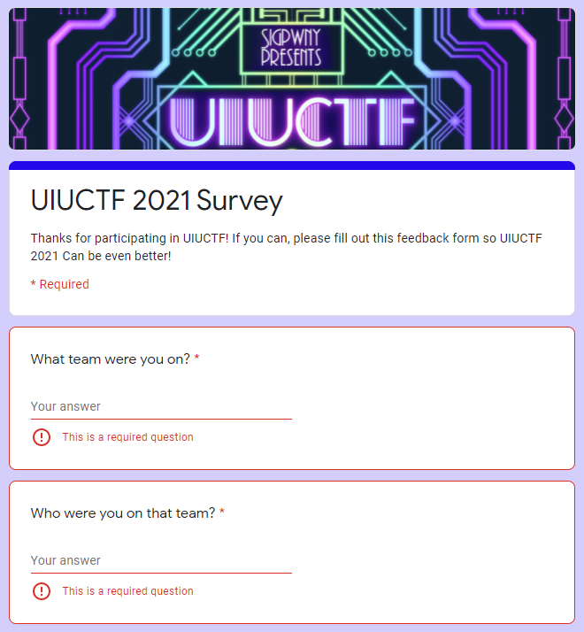
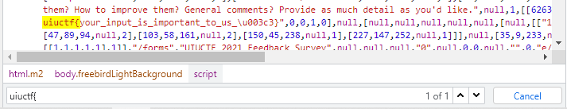
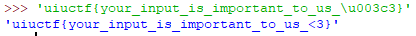
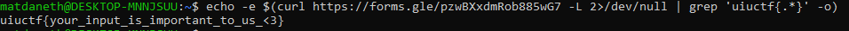

# Feedback Survey - 1 pts, 167 solves

> Fill out  [This](https://forms.gle/pzwBXxdmRob885wG7)  feedback form! We would love to hear your input so we can continue to improve!

This challenge is a feedback survey that the ctf admins want us to fill out so they can improve their ctf for next year. We are going to look at a cool trick we can use to solve ctf feedback google forms without actually filling out the form. 

Note: Admins of ctf's put a lot of work into their ctf's, so consider filling out the form even if you get the flag with this method. This method is ideally used to first blood the challenge, then fill out the survey carefully after.

Looking at the google form, we can try to just submit the form without filling anything in, but the form requires us to fill out most of the form.

But we discovered a neat little trick that we can use to bypass all of this. If we just inspect the google form, and `ctrl+f` for `uiuctf{` in the html, we find the flag.

But the problem is that this particular flag, it has an emoji. The end of the flag is an emoji that is unicoded encoded. So we can decode it by using a python shell. If we wrap the flag with the encoded emoji with quotes, we can decode the unicoded emoji at the end.

We can shorten this process by using one simple shell command to automatically do all of this for us: `echo -e $(curl https://forms.gle/pzwBXxdmRob885wG7 -L 2>/dev/null | grep 'uiuctf{.*}' -o)`

This method will mostly also work with other ctf's feedback surveys by changing the url to the google form.

Flag: ` uiuctf{your_input_is_important_to_us_<3}`

Thanks to all uiuctf admins for the great ctf! :heart:
