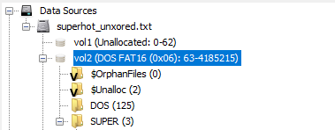
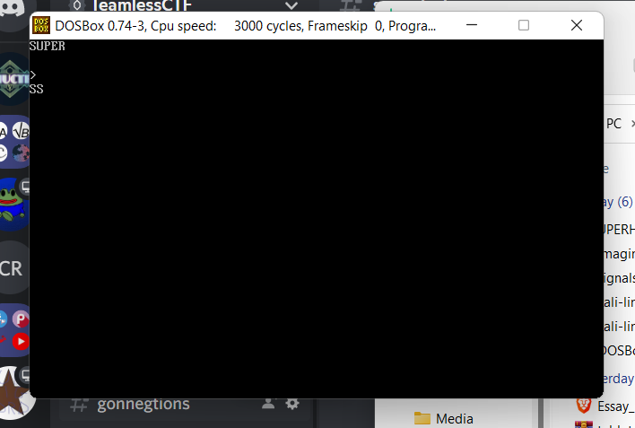
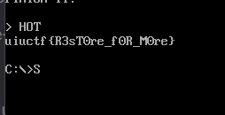

# SUPER - 371 pts, 18 solves

> HOT
>  
>  SUPERHOT

`SUPER` was a forensics challenge in UIUCTF 2021, where I played with `TeamlessCTF` and got 12th place.

We are given a weird file that has a bunch of `SUPERHOT` in it. As many file formats have a lot of null bytes in them, we can guess that this file was XORed with `SUPERHOT` using repeating key XOR. (This was later explicitly stated in a hint.) We can use [CyberChef](https://gchq.github.io/CyberChef/#recipe=XOR(%7B'option':'UTF8','string':'SUPERHOT'%7D,'Standard',false)) to do the XORing and recover the file.

Let's run `file` on it to see what the file is:

```bash
$ file superhot_unxored
superhot_unxored: Microsoft Disk Image, Virtual Server or Virtual PC, Creator vbox 6.1 (W2k) Wed Jun 23 18:38:26 2021, 2147483648 bytes, CHS 4161/16/63
``` 

Oh, so we have a disk image! We fire up [Autopsy](https://www.sleuthkit.org/autopsy/):



We find that there's an IRC log in `/LOG1.IRC`:

```
[13:33] *** Joins: white (whitehoodhacker@sigpwny) 
[13:33] <white> Dude, you should play SUPERHOT, it's the most innovative game I've played in years! 
[13:33] <white> I'll send it to your file server 
[13:35] <someradgamer> epic I'll check it out 
[13:38] <someradgamer> why does the setup create so many folders? 
[13:38] <someradgamer> I have to change directories so many times to reach superhot.exe 
[13:39] <white> Have you tried it yet? 
[13:40] <someradgamer> yeah, it's just some dumb title screen, how do I play? 
[13:40] <white> That *is* the game 
[13:40] <white> you just keep repeating the title 
[13:45] <white> oh I almost forgot to mention 
[13:46] <white> there's a bug where if you SUPERHOT too much, it will SUPERHOT your entire PC 
[13:47] <someradgamer> wait what 
[13:48] <someradgamer> that doesn't sound HOT 
[13:48] <someradgamer> I'm SUPER deleting this now 
[13:48] <someradgamer> what the HOT is happening to my SUPER computer!? 
[13:48] <SUPERHOT> SUPERHOT SUPERHOT SUPERHOT 
[SU:PE] <RHOT> SUPERHOT SUPERHOT SU PERHOT SUPERHOT SUPER HOT
```
A pretty weird conversation, ngl. In Autopsy we can also see a deleted file at ``.

We can run `file` on this:

```bash
$ file UPERHOT.exe
UPERHOT.exe: MS-DOS executable, MZ for MS-DOS
```
So, we see it's an exe file, just as the extension says. However, it's a 16 bit EXE.

We fire up DOSBox and run the program:



Seems that whenever we enter anything in, the program responds with `FINISH IT.`

We finish the word `SUPER` with the word `HOT`, and we get the flag:



Flag: `uiuctf{R3sT0re_f0R_M0re}`

Thanks WhiteHoodHacker for a cool challenge! 
