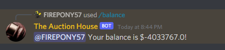

# buy_buy_buy

> I got a lot of items to sell so buy buy buy.

`buy_buy_buy` was a miscellaneous challenge in UIUCTF 2021 that involved using a Discord bot called `The Auction House#3393` to get the flag. 

The flag to the challenge could be obtained by buying the `Flag Common`, `Flag Rare`, and `Flag Ultra Rare` items from the market then running the command `/redeem_flags` to have the bot DM you the flag. 

There were two main ways to obtain enough money to buy the flag. We'll go over them, and then a vulnerability we found in the bot itself (unrelated to the challenge).

### Strategy 1: Bidding in the Auction House 
Every 10 minutes, the bot would generate an "auction house" in which you could bid for items that you could sell for a profit if you won the bid. The author of this challenge intended for people to be fighting over bids in the auction house, but since we were one of the first teams to attempt this challenge, we were able to outbid everyone and first blood the challenge.

There was a cool feature that allowed you to collect money from bidding on items even more quickly. The code for the Discord bot checks if you have enough money to bid on an item, but does not deduct that amount from your balance until the items as distributed at the end of the 10 minutes. 

You could exploit this feature by bidding on multiple items that you have just enough money for, then when items are distributed, you would have a negative balance. Then you could sell the items and gain a large profit.

With last year's bot, there was a transfer command that allowed you to give money to your teammates to purchase the flag quicker, but this year there did not seem to be a way to directly give somebody else money. But there is a commands that lets you create a private auction house where other users can sell items if they are invited. This can be used to sell items to teammates at the minimum 30% of the price, essentially giving money to another player.

### Strategy 2: Buying/Selling Clout
What's clout? Well, according to Google, clout is "a heavy blow with the hand or a hard object," or "influence or power, especially in politics or business." Let's go with the second definition.

There were certain items in the market that could be bought and sold for a profit, which allowed you to increase your balance. One of these items was `clout`. 

You could continue buying and selling large amounts of clout to exponentially increase your balance, but due to a flaw in the bot, buying selling large amounts of clout would not succeed (more on that later :eyes:).

If you bought and sold manageable amounts of clout for around an hour, it was possible to buy all three `Flag` items in the shop and get the flag to the challenge. This is the fastest way to obtain the flag.

### Bonus: The Exploit
While playing with the bot, we were able to find a denial of service vulnerability allowing us to disallow other users from using the bot for an extended period of time. This exploit was found when using Strategy 2 to become super rich. Apparently, when buying large an amount of an item, you can stop the bot from working for a period of time. 

Upon finding the exploit, and testing it for about an hour, we contacted admins and discovered what was most likely the problem. Whenever a user bought an item, it went into a for loop that executed a SQL commands which added one of the item you bought into your table. When trying to do this 50k times, It would stop the bot from responding to anyone for a period of time because it was too busy running SQL commands.

After then selling the items for a profit, then buying a large amount of items again, we could stop the bot for longer and longer periods of time. Admins told us to stop using the exploit and to let other people still have a chance at solving the challenge.

This exploit could have been used to prevent people from solving the challenge and keep the challenge point value higher. So this exploit could have been used to gain a competitive advantage due to dynamic scoring.

Flag: `uiuctf{at_the_bang_of_the_gavel_only_one_can_win}`

Thanks to Pranav for yet again making a (vulnerable) discord bot challenge! :wink:
