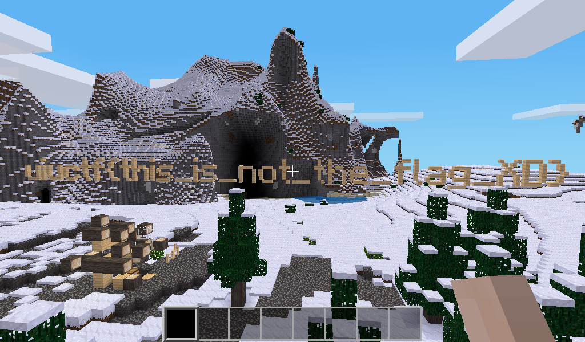
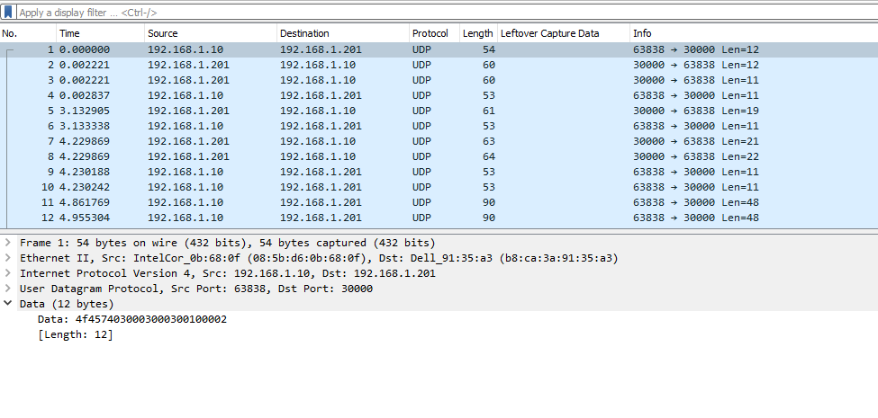
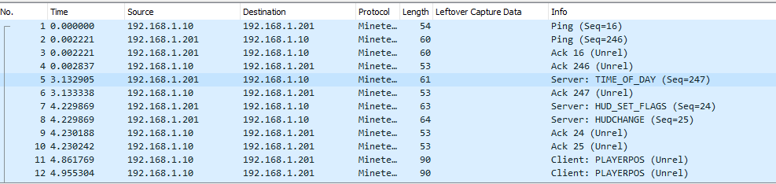
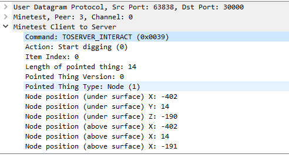

# toobeetootee - 464 pts, 7 solves
> Oh no! the infamous popbob hacked into my Minetest server, griefed my house, and tampered with the flag! Luckily, I was running a network capture at the time. Can you help me rollback the damage?
> 
> toobeetootee.pcap world.zip

`toobeetootee` was a forensics challenge in UIUCTF 2021, where I played with `TeamlessCTF`, getting second blood on this challenge and 12th place overall. Let's dive into the challenge.

We are presented with a PCAP file and a zip file containing the minetest world. Upon inspection, we find that the world contains a fake flag written using Minetest blocks (pine wood blocks, to be exact :P).

Seems that this challenge won't be so easy. Let's look at the challenge description again.

> the infamous popbob hacked into my Minetest server, griefed my house, and tampered with the flag! Luckily, I was running a network capture at the time.

This hints at how the real flag had been in the location that the fake flag is now, but was destroyed and then replaced with the fake flag, all while the packet capture was running. Let's take a look at that packet capture!

Loading up the capture in Wireshark, we notice that Minetest is using UDP packets to send data between clients and the server. However, this is not being done in any human-readable way, so we need some way to translate this into something we can understand.

How can we do this? We could read the Minetest source code (It's open source at https://github.com/minetest/minetest), but it would be cool if that work was done for us. Thankfully, inside the Minetest source repository on github we can find a Wireshark plugin that will parse Minetest network traffic at https://github.com/minetest/minetest/blob/master/util/wireshark/minetest.lua. Cool!

Now, we just need to install the plugin to our Wireshark install, and voila! Our network traffic is parsed for us!

We notice that some packets are labeled as `TOSERVER_INTERACT`. These are the packets that we will be focused on. The packets contain information about what action was done, as well as where the action was done (as XYZ in-game coordinates). For those unfamiliar with how coordinates in Minecraft and Minetest work, the X and Z coordinates represent movement parallel to the ground while the Y coordinate represents up/down movement.

