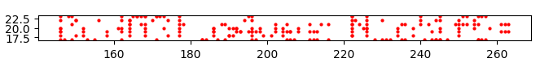

# toobeetootee - 464 pts, 7 solves

> Oh no! the infamous popbob hacked into my Minetest server, griefed my house, and tampered with the flag! Luckily, I was running a network capture at the time. Can you help me rollback the damage?
> 
> toobeetootee.pcap world.zip

`toobeetootee` was a forensics challenge in UIUCTF 2021, where I played with `TeamlessCTF`, getting second blood on this challenge and 12th place overall. Let's dive into the challenge.

We are presented with a PCAP file and a zip file containing the minetest world. Upon inspection, we find that the world contains a fake flag written using Minetest blocks (pine wood blocks, to be exact :P).


Seems that this challenge won't be so easy. Let's look at the challenge description again.

> the infamous popbob hacked into my Minetest server, griefed my house, and tampered with the flag! Luckily, I was running a network capture at the time.

This hints at how the real flag had been in the location that the fake flag is now, but was destroyed and then replaced with the fake flag, all while the packet capture was running. Let's take a look at that packet capture!

Loading up the capture in Wireshark, we notice that Minetest is using UDP packets to send data between clients and the server. However, this is not being done in any human-readable way, so we need some way to translate this into something we can understand.


How can we do this? We could read the Minetest source code (It's open source at https://github.com/minetest/minetest), but it would be cool if that work was done for us. Thankfully, inside the Minetest source repository on github we can find a Wireshark plugin that will parse Minetest network traffic at https://github.com/minetest/minetest/blob/master/util/wireshark/minetest.lua. Cool!

Now, we just need to install the plugin to our Wireshark install, and voila! Our network traffic is parsed for us!


We notice that some packets are labeled as `TOSERVER_INTERACT`. These are the packets that we will be focused on. The packets contain information about what action was done, as well as where the action was done (as XYZ in-game coordinates). For those unfamiliar with how coordinates in Minecraft and Minetest work, the X and Z coordinates represent movement parallel to the ground while the Y coordinate represents up/down movement.


Reading the source code for the Wireshark plugin, we notice that there are multiple actions that a `TOSERVER_INTERACT` packet can signify:

```lua
-- TOSERVER_INTERACT

do
	local abbr = "minetest.client.interact_"
	local vs_action = {
		[0] = "Start digging",
		[1] = "Stop digging",
		[2] = "Digging completed",
		[3] = "Place block or item",
		[4] = "Use item",
		[5] = "Activate held item",
	}
```

We see that these packets could mean starting/stopping/completing digging, placing blocks, using items, and activating items. Here, we will use action `0`, which represents the `Start digging` action.

We set up a filter in Wireshark to filter out anything that is not a `TOSERVER_INTERACT` packet with action `0`. Using autocomplete and looking at the plugin's source, we find that `minetest.client.interact_action == 0` works. After that, we use Wireshark's Export Packets feature (File > Export Packet Dissections > As Plain Text) to get a text dump of our filtered packets. (I put this in `start_digging_packets.txt` if you would like to take a look).

Now that we have a text dump of the packets, we can parse them into a format that is useful for us. I used my personal favorite text parsing tool, `grep`! (I know, very advanced)

I wrote 

```bash
grep 'under surface' start_digging_packets.txt | grep -oE '[X|Y|Z]: -?[0-9]+ > coordinates.txt'
```

Now, we have a file with the coordinates of each block that was dug.

We can now write a python script to complete the parsing and then plot the coordinates.

First of all, we load our coordinates into a python data structure. I used a list of three element lists, each three element list representing a point.

```python
lines = [l.strip() for l in open("coordinates.txt").readlines()][::-1] # To get X,Y,Z in the correct order when using pop()

coords = []

for n in range(len(lines)//3):
	coords.append([int(lines.pop().replace("X: ", "")), int(lines.pop().replace("Y: ", "")), int(lines.pop().replace("Z: ", ""))])
```

At first, I plotted the coordinates in 3D, because I had all three dimensions. However, I found that this was unneccesary because all the blocks of the flag are arranged in a plane perpendicular to the ground, as the fake flag is. So, I used matplotlib to plot the flag in 2D, allowing for some margin of error in case the flag was shifted when the fake one was created.

```python
fig = plt.figure()
ax = plt.axes()

for n in coords:
	if n[0] < -350 and n[0] > -380: # near the X coordinates of the flag
		# plot the Y and Z coordinates, because the flag is built top to bottom. 
		# Also flip the Z-coordinates because of which way the flag is facing 
		# (so the flag won't be reversed on our plot)
		plt.plot(-n[2], n[1], 'ro', markersize=2) 

ax.set_aspect("equal", "box") # Get pyplot to give us equal X and Y scales, because that's how they appear in-game

plt.show()
```

With that, we can plot the coordinates on our grid and view where the blocks were destroyed:



Although some blocks are missing, we can see that the text is some variant of `BudG3t_c4ves_N_cl1ffs`. The rest of the flag is the flag format (`uiuctf{` and `}`), which was not destroyed but are still in the world as part of the fake flag. So, our flag is some variation of `uiuctf{BudG3t_c4ves_N_cl1ffs}`. After some trial and error on CTFd, we find that the correct flag is `uiuctf{BudG3t_c4ves_N_cl1fFs}`.

Flag: `uiuctf{BudG3t_c4ves_N_cl1fFs}`

Thanks WhiteHoodHacker and SIGPwny for an amazing challenge!

Note: I talked to the challenge author, WhiteHoodHacker, who told me that the reason I was having ambiguities with the final flag was because some parts of the flag were not destroyed, but were actually used as part of the fake flag. The intended solution was to write a minetest mod to reverse the steps recorded in a packet capture, so that the flag could be viewed in the Minetest world.
